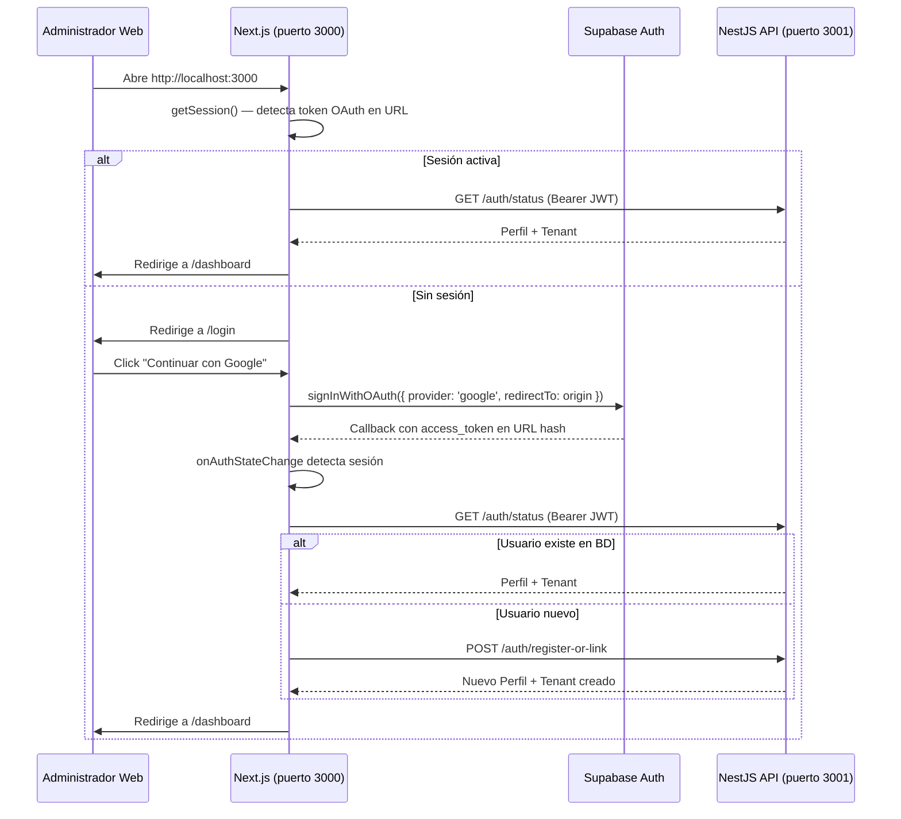

# FRONTEND_WEB.md — Panel de Control Administrativo

Este documento describe la arquitectura, decisiones de diseño, stack tecnológico e integración de la aplicación web de gestión (Dashboard) creada en `pos-saas/apps/web`.

---

## 1. Stack Tecnológico

| Capa | Tecnología |
|------|-----------|
| **Framework** | Next.js 16 (App Router) + React 19 |
| **Lenguaje** | TypeScript |
| **Sistema de Diseño** | **shadcn/ui** (componentes headless sobre Radix UI) |
| **Estilos** | Tailwind CSS v4 (motor de utilidades CSS usado internamente por shadcn/ui) |
| **Iconos** | Lucide React |
| **Autenticación** | Supabase Auth (Google OAuth via `@supabase/supabase-js`) |
| **Estado servidor** | TanStack Query v5 (React Query) |
| **Estado global** | React Context API (`AuthContext`) |

> **Nota**: El usuario final del dashboard **nunca escribe clases Tailwind directamente**. Todos los estilos pasan por los componentes de **shadcn/ui** que abstraen Tailwind internamente. Las clases de composición se gestionan con las utilidades `cn()` (clsx + tailwind-merge) y variantes CVA.

> Las reglas de autenticación, multi-tenant y sincronización no se duplican aquí; su definición canónica vive en [PROJECT_CONTEXT.md](PROJECT_CONTEXT.md), [API_SPEC.md](API_SPEC.md) y [SYNC_STRATEGY.md](SYNC_STRATEGY.md).

---

## 2. Puertos de ejecución local

| Servicio | Puerto | Comando |
|---------|--------|---------|
| Frontend (Next.js) | `3000` | `node node_modules/next/dist/bin/next dev` (desde `apps/web`) |
| Backend (NestJS) | `3001` | `pnpm run start:dev` (desde `backend`) |

La variable de entorno del frontend que apunta al backend es:
```env
# apps/web/.env.local
NEXT_PUBLIC_API_URL=http://localhost:3001/api/v1
```

---

## 3. Estructura de Carpetas

```text
pos-saas/apps/web/
│
├── src/
│   ├── app/                    # Rutas de Next.js (App Router)
│   │   ├── dashboard/          # Panel protegido y módulos CRUD
│   │   │   ├── employees/      # Vista de gestión de empleados y PINs
│   │   │   ├── products/       # Vista de catálogo y stock
│   │   │   ├── sales/          # Vista de auditoría de tickets emitidos
│   │   │   ├── layout.tsx      # Sidebar y navegación controlada por roles
│   │   │   └── page.tsx        # Resumen métrico y distribución de pagos
│   │   │
│   │   ├── login/              # Pantalla de acceso mediante Google OAuth
│   │   ├── globals.css         # Variables CSS base y estilos globales
│   │   ├── layout.tsx          # Estructura HTML raíz y Providers
│   │   └── page.tsx            # Redireccionador inicial de sesión
│   │
│   ├── components/
│   │   ├── ui/                 # Componentes shadcn/ui
│   │   │   ├── badge.tsx       # Componente de etiquetas e indicadores
│   │   │   ├── button.tsx      # Botones con variantes CVA
│   │   │   ├── card.tsx        # Contenedores estructurados
│   │   │   ├── dialog.tsx      # Modales Radix UI para formularios
│   │   │   ├── input.tsx       # Controles de formulario
│   │   │   └── table.tsx       # Contenedor de tablas semánticas
│   │   │
│   │   └── Providers.tsx       # Contenedor global de QueryClient y Auth
│   │
│   ├── context/
│   │   └── AuthContext.tsx     # Contexto de sesión y vinculación con NestJS
│   │
│   └── lib/
│       ├── supabase.ts         # Inicializador del SDK de Supabase Auth
│       └── utils.ts            # Función "cn" para combinación de clases shadcn
│
├── .env.local                  # Variables de entorno (SUPABASE_URL, API_URL)
├── package.json
└── tsconfig.json
```

---

## 4. Sistema de Diseño — shadcn/ui

**shadcn/ui** no es una librería de componentes instalada como paquete npm. Es un conjunto de componentes que se copian directamente al repositorio bajo `src/components/ui/`, manteniendo total control sobre el código.

### Principios clave

1. **`cn()` utility** (`src/lib/utils.ts`):  
   Combina clases condicionalmente con `clsx` y resuelve conflictos de especificidad con `tailwind-merge`.

2. **CVA (Class Variance Authority)**:  
   Los componentes `Button` y `Badge` usan CVA para definir variantes (`variant`, `size`) de forma declarativa y type-safe.

3. **Radix UI primitivas**:  
   Componentes complejos como `Dialog` se construyen sobre primitivas headless de Radix UI (`@radix-ui/react-dialog`, `@radix-ui/react-slot`), garantizando accesibilidad (foco, teclado, ARIA) sin perder control visual.

4. **Paleta visual**:  
   Colores oscuros (`slate-950` base) con efectos glassmorphism (`backdrop-blur`, bordes semitransparentes) y acentos en `indigo` y `purple`.

### Componentes disponibles

| Componente | Archivo | Descripción |
|-----------|---------|-------------|
| `Button` | `ui/button.tsx` | Variantes: `default`, `outline`, `link`, `destructive` |
| `Badge` | `ui/badge.tsx` | Variantes: `default`, `success`, `warning`, `destructive`, `secondary` |
| `Card` | `ui/card.tsx` | Con sub-componentes: `CardHeader`, `CardTitle`, `CardDescription`, `CardContent` |
| `Input` | `ui/input.tsx` | Input base con estilos consistentes |
| `Dialog` | `ui/dialog.tsx` | Modal con `DialogContent`, `DialogHeader`, `DialogTitle` |
| `Table` | `ui/table.tsx` | Con sub-componentes: `TableHeader`, `TableBody`, `TableRow`, `TableHead`, `TableCell` |

---

## 5. Flujo de Autenticación (Google OAuth)



### Resiliencia del AuthContext

Si el backend NestJS no está disponible, el `AuthContext` **no borra la sesión de Supabase**. En su lugar, crea un perfil mínimo desde el token de Supabase para que el usuario pueda ingresar. Esto evita que el login quede "atascado" en el spinner cuando el backend tarda en responder.
