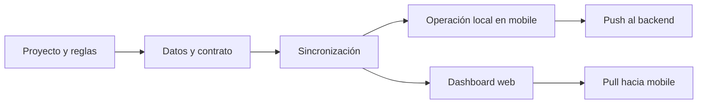

# Mapa de Documentación

Este archivo es el punto de entrada para entender el proyecto sin leer documentos duplicados o en desorden.

La regla es simple: primero se lee el esqueleto, después el flujo operativo, y al final los documentos de apoyo o diagnóstico.

## Orden de lectura recomendado

1. [PROJECT_CONTEXT.md](PROJECT_CONTEXT.md) - visión, principios, arquitectura general y stack.
2. [REPOSITORY_STRUCTURE.md](REPOSITORY_STRUCTURE.md) - organización del monorepo y convenciones base.
3. [DEV_SETUP.md](DEV_SETUP.md) - cómo levantar el entorno local sin romper nada.
4. [PRODUCT_REQUIREMENTS.md](PRODUCT_REQUIREMENTS.md) - qué debe resolver el MVP.
5. [DATABASE_SCHEMA.md](DATABASE_SCHEMA.md) - contrato de datos y entidades.
6. [API_SPEC.md](API_SPEC.md) - contrato entre frontend, backend y sincronización.
7. [SYNC_STRATEGY.md](SYNC_STRATEGY.md) - lógica central de offline-first y sync bidireccional.
8. [ROADMAP.md](ROADMAP.md) - fases y prioridades del proyecto.
9. [ROADMAP_FRONTEND.md](ROADMAP_FRONTEND.md) - estado y pendientes del dashboard web.
10. [FRONTEND_WEB.md](FRONTEND_WEB.md) - arquitectura y reglas del panel web.
11. [CONEXION_APPxBACKEND.md](CONEXION_APPxBACKEND.md) - guía de diagnóstico para auth y conectividad.
12. [CONTROL_CAMBIOS.md](CONTROL_CAMBIOS.md) y [CONTROL_CAMBIOS_BACKEND.md](CONTROL_CAMBIOS_BACKEND.md) - checklist de verificación antes de cerrar cambios.
13. [HARDWARE.md](HARDWARE.md) - referencia de hardware; hoy está incompleto.

## Documentos canónicos

Estos son los que definen el esqueleto del sistema y deberían evitar duplicación:

- [PROJECT_CONTEXT.md](PROJECT_CONTEXT.md)
- [DATABASE_SCHEMA.md](DATABASE_SCHEMA.md)
- [API_SPEC.md](API_SPEC.md)
- [SYNC_STRATEGY.md](SYNC_STRATEGY.md)
- [ROADMAP.md](ROADMAP.md)

Si una decisión cambia el producto, la arquitectura o el flujo, primero se actualiza uno de estos documentos.

## Documentos de apoyo

Estos documentos no definen el esqueleto; sirven para operar, implementar o depurar:

- [REPOSITORY_STRUCTURE.md](REPOSITORY_STRUCTURE.md)
- [DEV_SETUP.md](DEV_SETUP.md)
- [FRONTEND_WEB.md](FRONTEND_WEB.md)
- [ROADMAP_FRONTEND.md](ROADMAP_FRONTEND.md)
- [CONEXION_APPxBACKEND.md](CONEXION_APPxBACKEND.md)
- [CONTROL_CAMBIOS.md](CONTROL_CAMBIOS.md)
- [CONTROL_CAMBIOS_BACKEND.md](CONTROL_CAMBIOS_BACKEND.md)
- [HARDWARE.md](HARDWARE.md)

## Flujo mental del proyecto

La lectura práctica debe seguir este orden:

- Entender la visión y el límite del sistema.
- Confirmar el contrato de datos y API.
- Revisar cómo se sincroniza y dónde vive la fuente de verdad.
- Después entrar a la implementación de cada app.

## Reglas para no romper el esqueleto

- No duplicar en varios documentos la misma definición de stack, auth o sync.
- No corregir un flujo en un documento secundario si antes no se actualiza el documento canónico.
- Si aparece una contradicción, la prioridad la tiene el documento canónico del dominio correspondiente.
- El dashboard web, el backend y el móvil deben describirse como piezas del mismo flujo, no como proyectos separados.