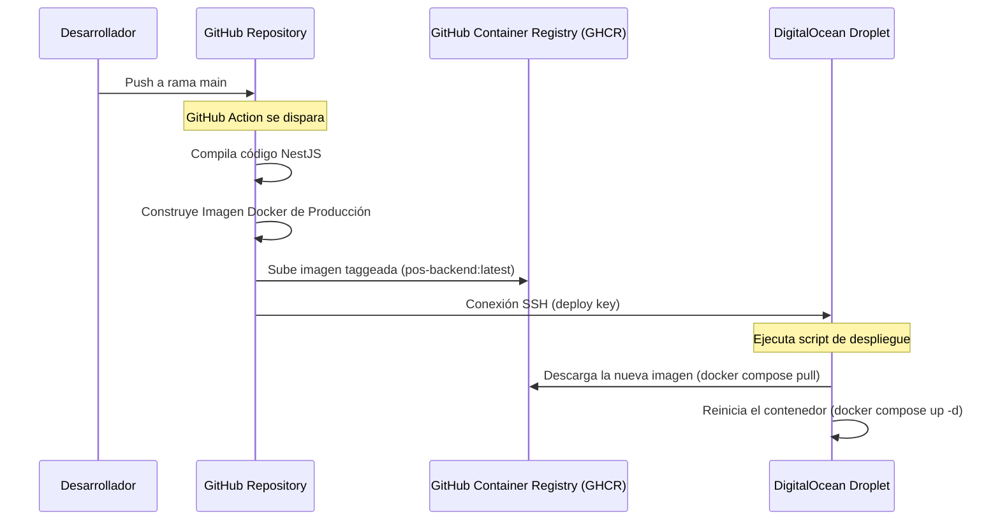

# Plan de Despliegue e Infraestructura de Producción (Fase 1 - DigitalOcean)

Este documento detalla la planificación de la infraestructura SaaS para el despliegue del backend en **DigitalOcean** y la integración de servicios administrados en **Supabase** para la base de datos, autenticación y almacenamiento.

---

## 1. Arquitectura General del Sistema

```mermaid
graph TD
    Client[App Móvil Expo / Web Next.js] -->|HTTPS / WSS| DO_Firewall[DigitalOcean Cloud Firewall]
    DO_Firewall -->|Puertos 80, 443| Nginx[Nginx Reverse Proxy]
    subgraph DigitalOcean Droplet (Ubuntu 24.04 LTS)
        Nginx -->|Proxy Pass: 3000| NestApp[Docker: NestJS App]
    end
    subgraph Supabase (Cloud Administrado)
        NestApp -->|PostgreSQL Query| DB[(PostgreSQL)]
        NestApp -->|Auth API| Auth[Supabase Auth]
        NestApp -->|Storage API| Storage[Supabase Storage]
    end
```

### Componentes de Infraestructura:
* **DigitalOcean Droplet**: VPS con procesador Premium Intel/AMD y discos NVMe (Recomendado: 1 vCPU / 2GB RAM para la etapa Beta) corriendo Ubuntu 24.04 LTS.
* **DigitalOcean Cloud Firewall**: Firewall de red externo gratuito para bloquear tráfico no autorizado antes de que impacte en el VPS.
* **NestJS (Dockerized)**: Aplicación Node.js empaquetada e instrumentada en Docker.
* **Nginx Reverse Proxy & Certbot**: Proxy reverso y gestor de certificados SSL Let's Encrypt automatizados mediante Docker Compose.
* **Supabase**: Base de datos administrada PostgreSQL, Autenticación (Supabase Auth) y Storage de imágenes.

---

## 2. Organización del VPS y Sistema Operativo

* **Sistema Operativo**: **Ubuntu 24.04 LTS** (Noble Numbat). Es el estándar de producción más extendido, garantizando máxima compatibilidad con Docker, soporte de parches de seguridad a largo plazo y estabilidad de librerías.
* **Organización de Directorios**:
  ```text
  /srv/pos-saas/
  ├── docker-compose.yml
  ├── nginx/
  │   └── nginx.conf
  └── .env.production
  ```
  Los archivos de configuración y datos se ubicarán bajo el directorio del sistema `/srv/pos-saas/` asignado al usuario administrador de despliegue.

---

## 3. Seguridad e HTTPS con Let's Encrypt

* **DigitalOcean Cloud Firewall**:
  * Reglas de entrada:
    * HTTP (Puerto `80`) -> Permitido para todo origen (Challenge de Certbot).
    * HTTPS (Puerto `443`) -> Permitido para todo origen (Consumo de la API).
    * SSH (Puerto `22`) -> Permitido únicamente para tu IP pública o llaves autorizadas.
  * Reglas de salida: Todo permitido.
* **Hardening SSH**:
  * Acceso exclusivo mediante llave pública criptográfica SSH.
  * Deshabilitar login por contraseña (`PasswordAuthentication no`) y deshabilitar acceso directo de `root` (`PermitRootLogin no`).
* **Fail2ban**: Instalado en el sistema anfitrión para bloquear IPs sospechosas tras múltiples intentos fallidos de conexión.
* **Cifrado SSL**: Nginx configurado con TLS 1.2/1.3, algoritmos de cifrado ECDHE/AES-GCM modernos y redirección HTTP -> HTTPS forzada.

---

## 4. Gestión de Secretos y Variables de Entorno

* Las variables de entorno críticas de producción **nunca** se suben a GitHub.
* En el Droplet, se almacenarán en un archivo seguro `/srv/pos-saas/.env.production` con permisos restringidos (`chmod 600`).
* Este archivo contendrá:
  * URLs y llaves secretas de conexión a Supabase (`SUPABASE_URL`, `SUPABASE_SERVICE_ROLE_KEY`).
  * Secretos de JWT y configuraciones de firma.
  * Credenciales del entorno de producción.

---

## 5. Estrategia de Despliegue y CI/CD con GitHub Actions

Para lograr un pipeline ágil y profesional de integración y despliegue continuo (CI/CD):



1. **GitHub Container Registry (GHCR)**: Se compila y almacena la imagen Docker de NestJS de producción en el registro de paquetes privado de GitHub.
2. **GitHub Actions**: Al realizar push a la rama principal `main`, se ejecuta el workflow de compilación, empaquetado Docker y notificación vía SSH al VPS para descargar la última imagen (`docker compose pull`) y reiniciar el servicio sin fricción.

---

## 6. Logs, Backups, Monitoreo y Escalabilidad

* **Rotación de Logs**: Docker configurado con `local` logging driver limitando el tamaño máximo del log a 10MB y reteniendo un máximo de 3 archivos rotativos.
* **Copias de seguridad (Backups)**:
  * Base de datos: Backups diarios automáticos provistos directamente por el plan gestionado de Supabase.
  * Configuración del VPS: DigitalOcean Backups semanales automáticos del Droplet activados.
* **Monitoreo**: Implementación de monitoreo externo simple mediante alertas de ping (ej. Better Stack o UptimeRobot) que avisen de inmediato vía Email o Slack ante cualquier interrupción de la API.
* **Escalabilidad Futura**:
  * Escalado Vertical: Incrementar los recursos del Droplet en DigitalOcean en pocos clics (Resize).
  * Escalado Horizontal: Introducir un balanceador de carga de DigitalOcean (Load Balancer) frente a múltiples Droplets corriendo la app NestJS en Docker.
